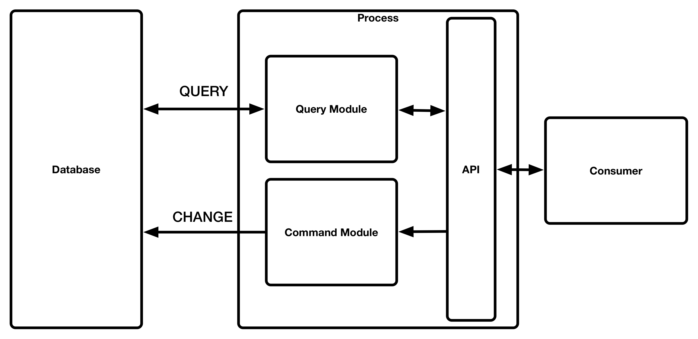
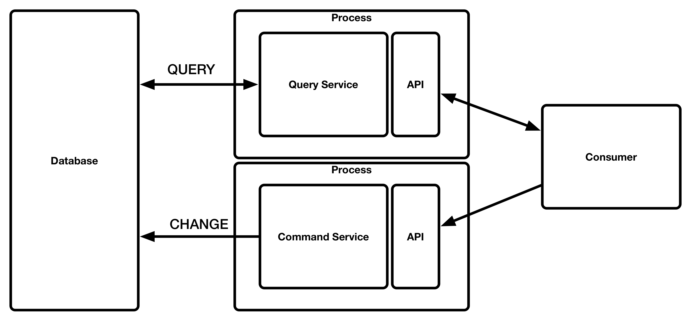
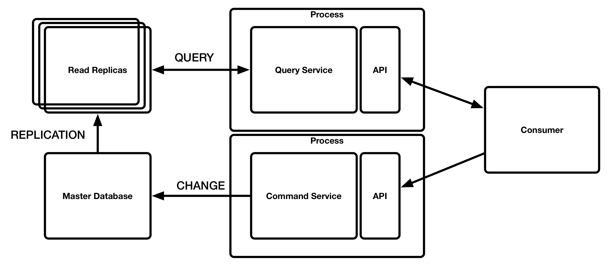
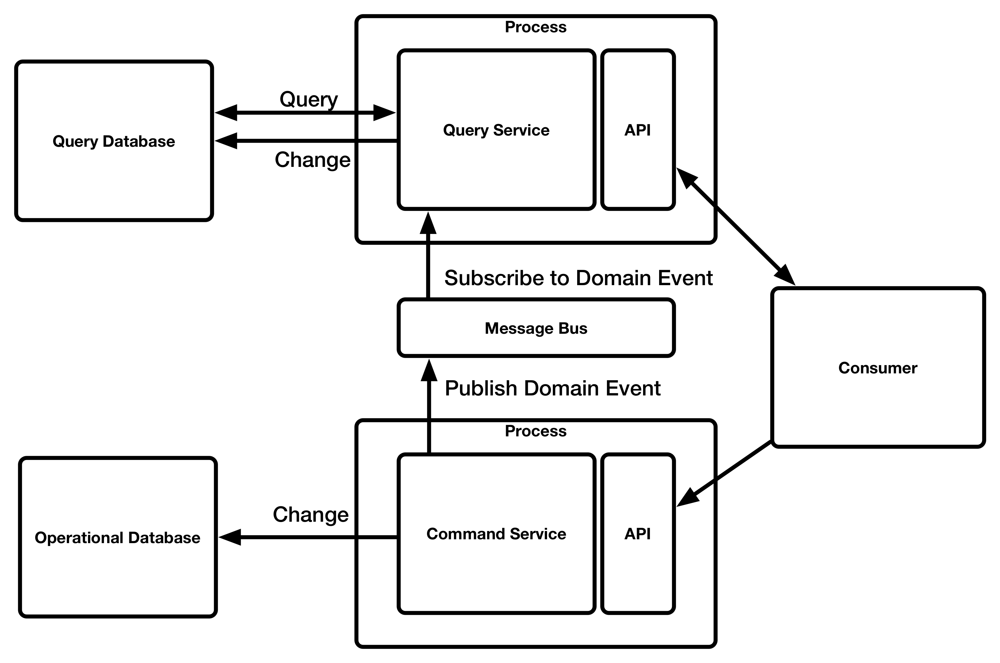
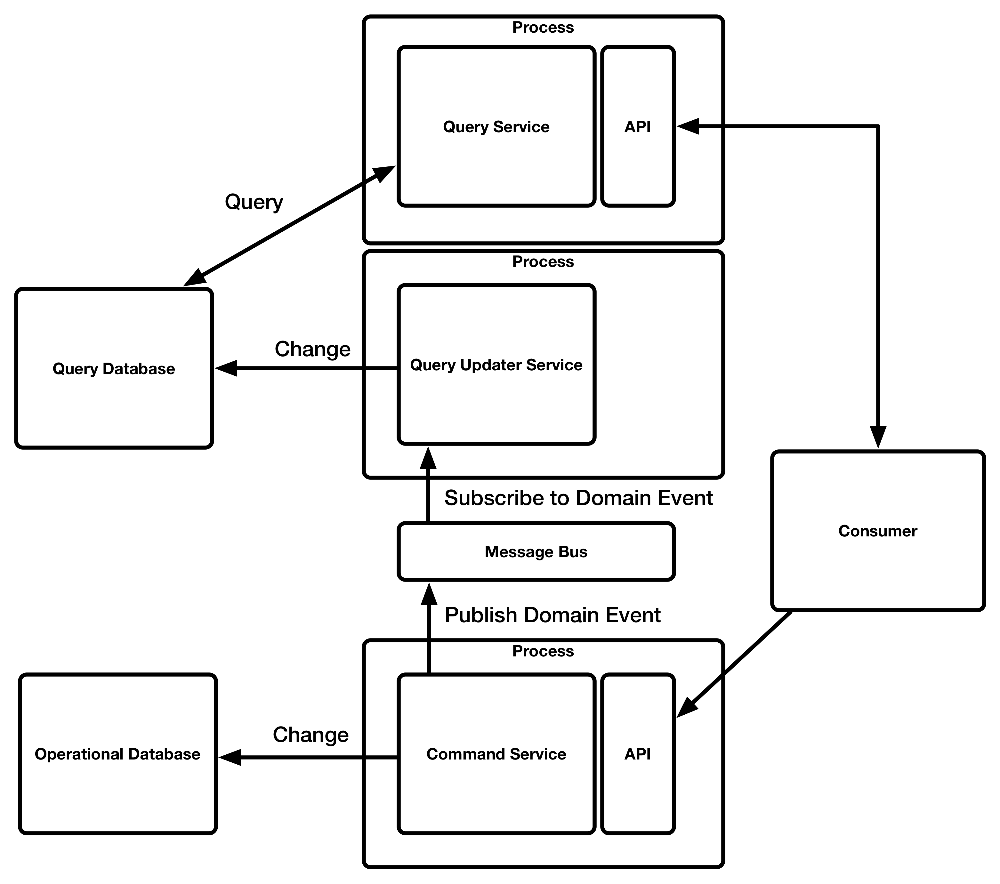
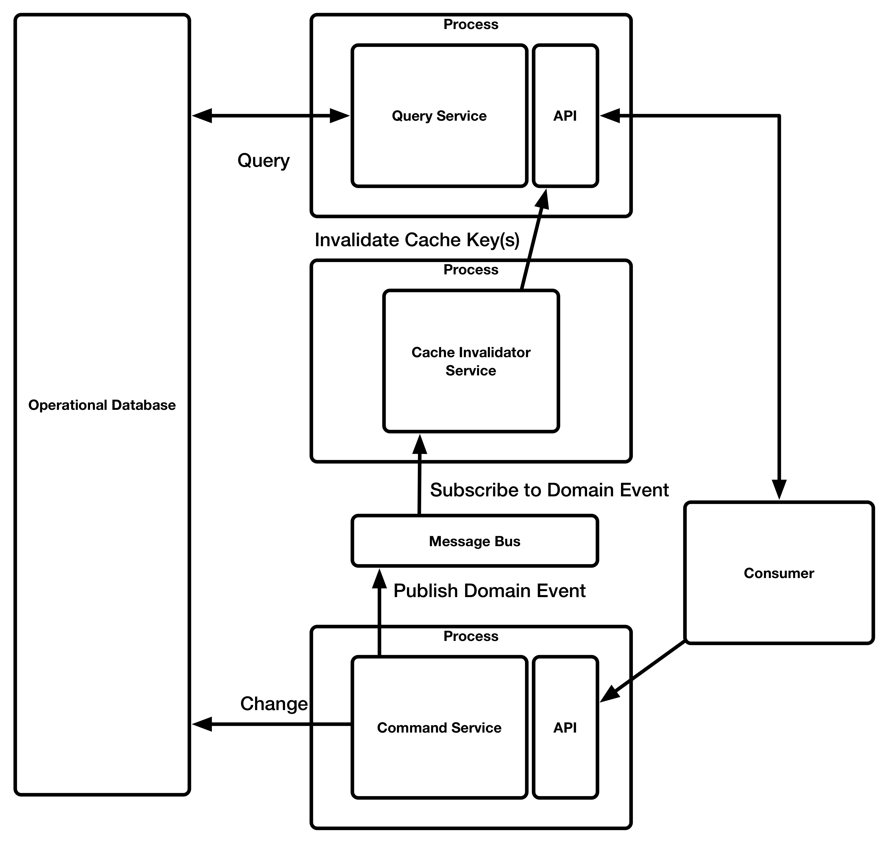

# Functional Patterns

## Command query responsibility segregation (CQRS)

CQRS **separates the responsibility** of handling queries from handling commands.

> - CQRS is not a silver bullet
> - CQRS is not a top level architecture
> - CQRS is not new
> - CQRS is not shiny
> - CQRS will not make your jump shot any better
> - CQRS is not intrinsically linked to DDD
> - CQRS is not Event Sourcing
> - CQRS does not require a message bus
> - CQRS is not a guiding principle / CQS is
> - CQRS is not a good wife
> - CQRS is learnable in 5 minutes
>  
> - CQRS is a small tactical pattern
> - 
> - CQRS can open many doors.
>  
> - And yes you can support RFC 2549 using CQRS
>
> by Greg Young [https://goodenoughsoftware.net/2012/03/02/cqrs/](https://goodenoughsoftware.net/2012/03/02/cqrs/)

### Definitions

The following defintions apply to the services which appear in the images in the examples of this section.

#### System

The overall system which is composed of the different services including the Query Service, Command Service, APIs, Database(s)

#### Query Service

The service **owning the responsibility** of handling the queries for the system.  Depending on the implementation this service could transform the data on read or it could simply be a dumb reader in the case where the data has already been transformed into a read optimized structure.

#### Command Service

The service **owning the responsibility** of handling commands which will change the operational data which the Query Service depends on.

#### API

The interface which is used to access the Query Service or the Command Service.  Each service will have their own set of APIs.  There could be one more API per service e.g. each could offer a REST API and a SOAP API bu the underlying service would remain constant.[^apigateway] [^hex]

[^apigateway]:  An API Gateway could be used to compose the different APIS into a single API for the system even though both APIs are hosted by different service.

[^hex]: Hexaganol architectue (by Alistair Cockburn) a.k.a ports and adatpers provides other very good reasons for how and why this appraoch of separating the API from the service is good practice. [http://alistair.cockburn.us/Hexagonal+architecture](http://alistair.cockburn.us/Hexagonal+architecture).  Robert Martin also described this architecture as a clean architecture [https://8thlight.com/blog/uncle-bob/2012/08/13/the-clean-architecture.html](https://8thlight.com/blog/uncle-bob/2012/08/13/the-clean-architecture.html)

#### Database

This refers to the write database, the read databases, the master database and the read replicas.  It refers to the database instances in each example in whatever for they take even if that example is a flat file implementation.

#### Consumer

The system or human consuming either the Query Service, the Command Service or both

Both the Query Service and the Command Service have a separate API.  A Service could be fronted with multiple different APIs hosted on different endpoints.

### a) Separate handlers in the same process with a single database

Separate modules inside a single process.  These could easily be separated out into individual processes if the requirement arises.  The data is transformed on read inside the Query Service.

### b) Separate processes with a single database

A modification to the above pattern is using a different process for the Query Service and the Command Service.  This separation could be done for performance reasons in that you query service could have different throughput requirements than your command service.   With this approach you could scale the two different services independently to match the required throughput for each.  This assumes that you have a suitable setup for your database so that you do not end up with unbalanced capabilities[^unbalanced] and overload the database itself.

[^unbalanced]: Chapter 4.8 Unbalanced Capabilities - Release It!  by Michael T. Nygard

### c) Separate processes with a database cluster with read replicas

One variation of this setup is when the database supports clustering and you can ensure your query service instances connect to read only replicates where your command service will be writing to the master database.  This is a common depoyment scenario for many different types of databases and relies on the database itself replicating the data from master to the replicas.  The Query Service then reads from the replicas to reduce contention of the master database and allows the reads of the database to be scaled out.

> **Separate Processes**
>
> When **separate processes** are mentioned in this guidance it means a separate OS process.  How each process is isolated and ran could come in different forms e.g.
>
> - single process inside a separate virtual server instance
> - single process inside a separate container
> 
> It could also mean multiple processes on the same virtual instance or inside a single container but the fact remains each service has its own service.

All of the examples so far need to use the same database technology and the Query Service needs to contain the relevant logic to satisfy the different queries which it will handle.

The complexity of the query logic will differ greatly and depend on the complexity, construction and technology of the database which it will read from.

> TODO: Example of this

### d) Separate processes with a separate database for the QueryStore and Write Store

In this setup a Message Bus is introduced so that when the Command Service processes a command and updates the write store, one or more events can be published which reflect the changes and allows subscribers to be notified of these changes.  One of the subscribers to these events would be the Query Service which would process the events and update the Read store with a read optimized structure of the data in the event.

The same technology could be used for the read and write stores or different technologies could be selected which allow for further optimizations either in the READ or the WRITE context.  For example the Write store may choose a relational database which is ACID compliant so that it can maintain data consistency where as the read store may choose a document store and create documents which contain information from many different events inside a single document.

The owness is on the Query Service here to transform the data on write and update the read store so that there are no data transformations required on read, making the reads quicker.

> The application architecture will determine the structure of the write store e.g.  
>  - Using Active Record then a relational data strore would fit well.
>  - Using Event Sourcing then an Event Store would fit which could take the form of flat files, key/value store, relational store etc...
>
> There are some specialist data stores specifically intended for use with Event Sourcing e.g. [https://geteventstore.com](https://geteventstore.com).  Other technologies which offer an event stream can also be used e.g. [Apache Kafka](http://kafka.apache.org)

### e) Separate processes with a separate database and a separate updater

In this example the concerns of the Query Service are split, the concern of handling the queries stays with the Query Service bu the responsibility of updating the data which the Query Service reads from is given to a separate service.  From a **separation of conerns** perspective this makes good sense but also similar to exmaple b) you may have different scaling factors for the two different services.

> In all these examples which show a **Message Bus** this could be any technology which provides a way of being notified which means it could be publisha dn subscribe or require consumers to poll.  As long as you can get notification that a command has been processed.

### f) Separate processes with a separate database using events to invalidate a cache

If a cache is put infront of the Query Service ti optimize performance, another solution using the Message Bus could be to use the notification to invalidate the cache so that the information being served is **less** stale.  The complexity and efficiency of the invalidation logic will be determined by the implementation of the caching and also the technology.  This is just another option which can be applied to gain another potential benefit from CQRS.

### g) UBER separation

This examples is deliberately exagerating the separation simply to show how this pattern could scale without modifying the existing system but by extending the services inside of the system each owning a different responsibility.  In this example we have different Query Services for different views of the data.  This pattern may be very useful for **Backends for Front Ends (BFF)** where each screen has a dedicated view and accompanying model so that it reduces the UI logic required to render with the UI simply reading the data and displaying it in the relevant form.

TODO:  Need an image

